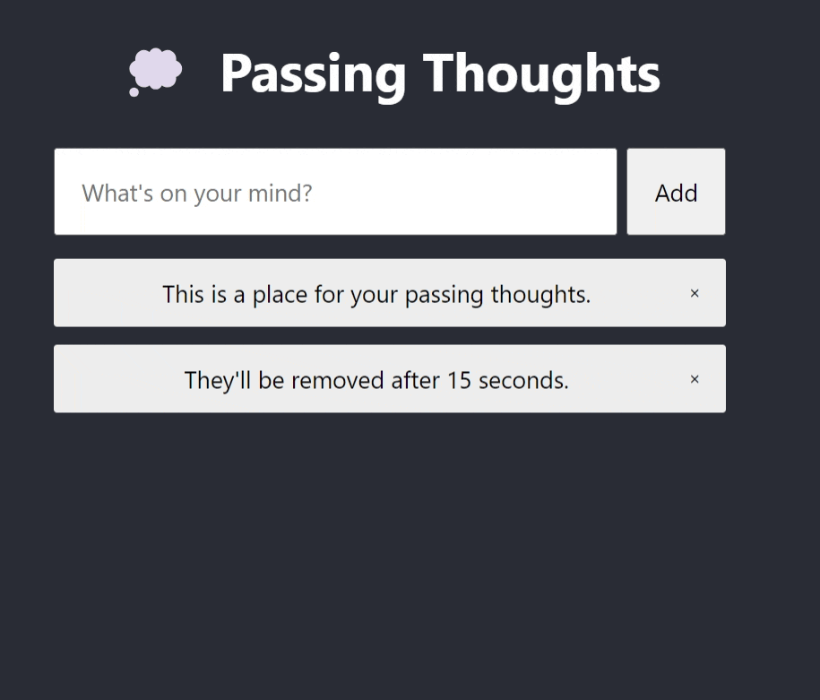

# Capture Passing Thoughts in React 🧠⚛️

<br />
<p align="center">
  <a href="https://github.com/jgome284/thoughts-react">
    
  </a>

  <h3 align="center">Foreword</h3>

  <p align="center">
    A React webapp to capture your fleeting thoughts....
    <br />
    <a href="https://github.com/jgome284/thoughts-react/issues">Report Bug</a>
    ·
    <a href="https://github.com/jgome284/thoughts-react/issues">Request Feature</a>
  </p>
</p>

## Table of Contents

- [Capture Passing Thoughts in React 🧠⚛️](#capture-passing-thoughts-in-react-️)
  - [Table of Contents](#table-of-contents)
  - [Setup](#setup)
  - [About](#about)
  - [Prerequisites](#prerequisites)
    - [Docker](#docker)
    - [Visual Studio Code](#visual-studio-code)
  - [Getting started](#getting-started)
  - [License](#license)

## Setup

This project includes a Dev Container for Visual Studio Code. It serves as a full-featured development environment with everything needed to run Node. Dev Containers separate tools, libraries, or runtimes needed for working with a codebase. They aid in continuous integration and testing. Dev containers can be run locally or remotely, in a private or public cloud, in a variety of supporting tools and editors.

[This DevContainer](.devcontainer) is built IAW the [DevContainers specification](https://containers.dev/implementors/spec/) and tailored for a development environment that runs Debian GNU/Linux 12 (bookworm). JavaScript dependencies are versioned in accordance with `package-lock.json` and project configurations are detailed in `package.json`. The devcontainer also has git for version control and several extensions installed for Visual Studio Code as IDE utilities.

<!-- ABOUT THE PROJECT -->
## About

[This project](https://github.com/jgome284/thoughts-react) leverages React for the front-end of a webapp. The app captures user input to display passing thoughts. React is a widely adopted JavaScript framework that is used to build user interfaces. With React, we create reusable components that rerender when changes for them are captured by the Virtual DOM.

<!-- PREREQUISITES -->
## Prerequisites

### Docker

To start, you need to have Docker Engine and Docker Compose on your machine. You can either:

- Install [Docker Desktop](https://www.docker.com/products/docker-desktop/) which includes both Docker Engine and Docker Compose. (Recommended ⭐)
- Install [Docker Engine](https://docs.docker.com/engine/install/binaries/) and [Docker Compose](https://docs.docker.com/compose/install/standalone/) as standalone binaries. (If it suits your fancy 🤵)

### Visual Studio Code

This devcontainer is setup for development on Visual Studio Code. You should have it installed along with the [remote development pack](https://marketplace.visualstudio.com/items?itemName=ms-vscode-remote.vscode-remote-extensionpack) to enable the IDE's DevContainers functionality.

<!-- GETTING STARTED -->
## Getting started

To start, open VS Code in a directory of your choice. With the terminal, clone this repository via `git clone https://github.com/jgome284/thoughts-react`.

Open Docker Desktop to run the Docker daemon, a background process that manages and coordinates Docker containers on your system. On VS Code, open your local copy of the project and start the development container by running `Dev Containers: Rebuild and Reopen In Container` in the command palette. It can be accessed with the keyboard shortcut `ctrl + shift + P` on your keyboard.

When the Dev Container launches, `cd` to the [`thoughts`](./thoughts/) directory and install project dependencies via npm by executing the following command. If successful, a `node_modules` folder should appear in your directory.

```sh
npm install
```

With dependencies installed, try running the application's build script! Our `package.json` has this aliased to the following command via npm.

```sh
npm run build
```

If successful, you should see a [`build`](./thoughts/build/) folder for the webapp. You can deploy the production build of the webapp on your local machine via the `serve` command detailed below. Then, open the webapp on localhost:3000 ... Now add fleeting thought that warm your merry heart! (ﾉ◕ヮ◕)ﾉ*:･ﾟ✧ ❤️!

```sh
serve -s thoughts/build
```

<h4 align="center"> Web App Demo</h4>
<p align="center">

</p>

## License

Distributed under the MIT License. See `LICENSE` for more information.
